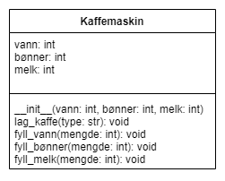

# Vurdering - Runde 2
## Kaffemaskin

I denne oppgaven skal du lage et program som simulerer en kaffemaskin. Denne kaffemaskinen skal kunne gjøre følgende:

1. Lage forskjellige typer kaffe: **Espresso**, **Americano** og **Cappuccino**.
2. Holde styr på ingredienser kaffemaskinen må ha: **vann**, **kaffebønner** og **melk**.
3. Gi beskjed når maskinen trenger mer ingredienser (vann, kaffebønner eller melk).
4. La brukeren fylle på mer vann, kaffebønner eller melk.
5. Vise en oversikt over maskinens nåværende ingredienser.

#### Oppskrifter
| Type     | Vann | Kaffebønner | Melk |
|----------|------|-------------|------|
|Espresso  |50 ml |18 g         |0 ml  |
|Americano |100 ml|18 g         |0 ml  |
|Cappuccino|100 ml|18 g         |50 ml |

### Funksjonelle krav
Programmet skal oppfylle følgende funksjonelle krav:

#### Klasse
* Programmet skal ha en klasse `Kaffemaskin` som holder styr på status og operasjonene til kaffemaskinen.
* `Kaffemaskin` må ha attributter for `vann`, `kaffebønner` og `melk`.
* `Kaffemaskin` må også ha metodene `lag_kaffe`, `fyll_vann`, `fyll_bønner` og `fyll_melk`.
* `lag_kaffe` skal trekke fra ingrediensene til en spesifisert type kaffe, mens `fyll_`-metodene skal fylle på en oppgitt mengde av ingrediensen.
* Kaffemaskinen skal si ifra om at den trenger påfyll hvis vannmengden er under 50 ml, eller kaffebønner er under 18 g, eller mengden melk er under 50 ml. Det skal ikke være mulig å lage kaffe hvis man ikke har ingredienser til det.

#### GUI
* Programmet skal ha et grafisk brukergrensesnitt (GUI)
* Grensesnittet skal kunne vise hvor mye det er av hver ingrediens til enhver tid, i tillegg til å kunne gi beskjeder om at en ingrediens snart er tom, tilbakemelding på at en kaffe ikke kan lages, eller en hyggelig beskjed om at kaffen er klar hvis den blir lagd.
* Grensesnittet skal også ha tre knapper, én knapp for hver type kaffe. Hvis brukeren klikker på en av knappene skal det lages en kaffe av den typen hvis det er nok ingredienser.
* Grensesnittet må også gjøre det mulig for brukeren å fylle på med ingredienser. Dette kan løses på en valgfri måte.

Utover de funksjonelle kravene er dere fri til å være så kreative dere bare vil. Det er f.eks vedlagt noen bilder som er mulig å bruke i programmet deres, men ikke nødvendig.

Programmet leveres på it'sLearning innen onsdag 20. november kl. 15:00. Deretter skal dere ha en høring fredag 22. november der dere vil bli spurt om programmet deres og fagstoff fra runde 2. Denne muntlige høringen vil sammen med prosjektet deres utgjøre karaktergrunnlaget.