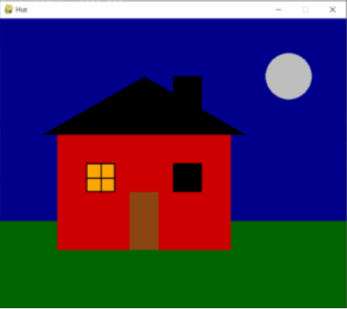

# Øvingsoppgaver 3.4

## 3.4.1
Lag et program med følgende spesifikasjoner:

* Vinduet skal ha størrelsen 600x500
* Tegn et hus omtrent tilsvarende som vist i bildet
* TIPS:
    - Se Pygame [fargeliste](https://anvilproject.org/guides/content/creating-links) for fargenavn
    - Bruk polygon til å tegne taket

## 3.4.2
Ta utganspunkt i filen enkel_animasjon.py og gjør følgende endringer:
- Endre programmet slik at ballen beveger seg horisontalt i stedet for vertikalt.
- Ballen skal fortsatt endre retning når den kolliderer med en vegg.
_Utfordring:_
- Få ballen til å bevege seg skrått og få ballen til å naturlig endre retning når den kolliderer med en vegg.

## 3.4.3
Lag et program med følgende spesifikasjoner
* Vinduet skal ha størrelsen 500x500
* En ball med diameter 40 piksler skal gå rundt i sikrel inni vinduet.
* Sirkelen skal ha en diameter på 400 piksler og være sentrert i vinduet.