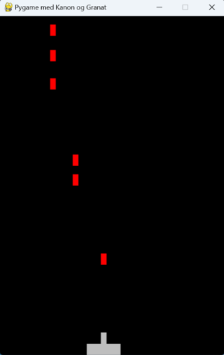

# Øvingsoppgaver 4.2

## 4.2.1
Lag et Pygame program der 

• Bredde og høyde er henholdsvis 400 og 600 piksler

• I bunnen skal det være en kanon som vist på figuren. 
Den skal kunne styres til høyre og venstre med 
piltastene, men ikke komme på utsiden av vinduet. 

• Når bruker trykker på mellomromstasten, skal kanonen 
avfyre en granat som kommer ut av munningen og 
fortsetter oppover på skjermen til den forsvinner og da 
må den slettes for å spare minne.

