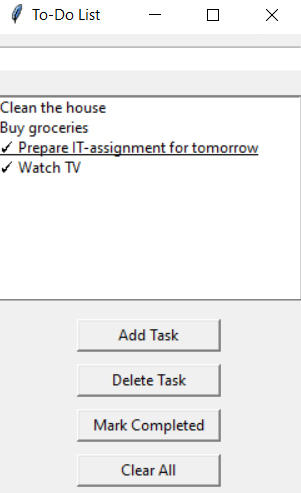

I denne oppgaven skal dere lage en to-do-liste. Å lage en slik to-do-liste er det
erketypiske inngangsprosjektet for nybegynnere som skal lage GUI-applikasjoner.

# Oppgave
Lag en to-do-liste med et enkelt brukergrensesnitt som skal inneholde følgende:

- En Entry-widget der brukeren kan skrive inn gjøremål
- En Listbox-widget der en liste over gjøremål vises
- Knapper som kan **legge til** nye gjøremål, **slette** et valgt gjøremål, **merke et gjøremål som fullført**, og **tømme hele listen**.

## Funksjonelle krav

### Legg til - knapp
- Når knappen trykkes skal gjøremålet fra Entry-widgeten legge til i Listbox-widgeten
- Vise en feilmelding hvis man prøver å legge til gjøremål med tom Entry-widget

### Slett - knapp
- Når knappen trykkes skal det valgte gjøremålet slettes fra Listbox-widgeten
- Vise en feilmelding hvis ingen gjøremål er valgt

### Merk som fullført - knapp
- Når knappen trykkes skal valgt gjøremål markeres som fullført
- Et gjøremål er markert fullført ved å endre farge, stryke over det med en linje, eller legge til et sjekk-merke foran

### Tøm listen - knapp
- Når knappen trykkes skal alle gjøremål fjernes fra listen

# Tips
- Bruk `command`-parameteren til Button-widgets for å knytte en knapp til en funksjon, som f.eks `legg_til` eller `slett`
- Bruk `listbox.get()` for å hente market oppgaven i Listbox-widgeten og `listbox.insert()` for legge til nye oppgaver
- Bruk `try-except`for å håndtere feil. `messagebox.showwarning(<string>)` viser en feilmeldingsboks.
